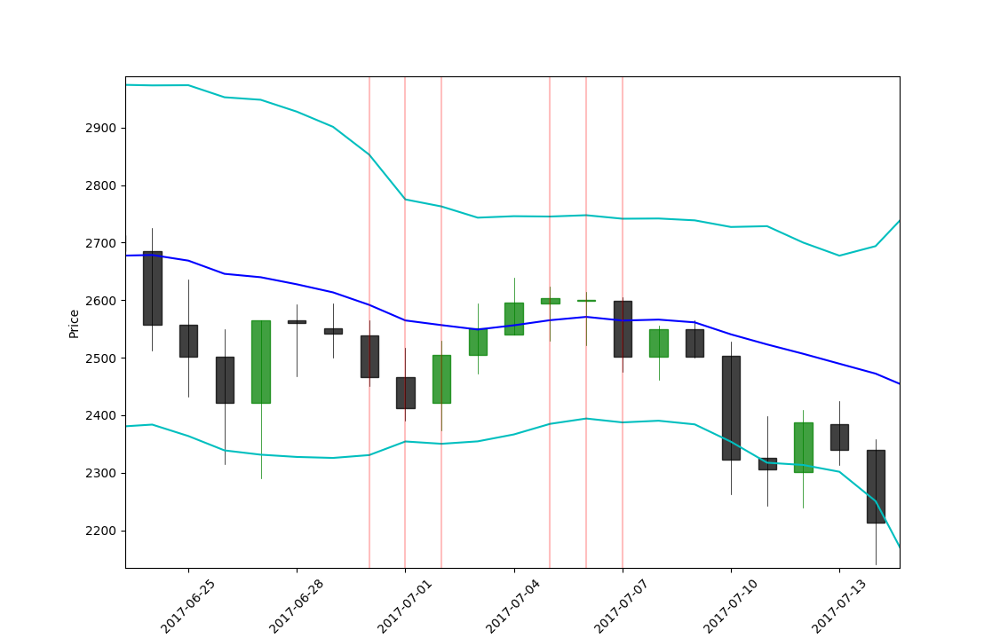

[](https://travis-ci.org/npapapietro/CandleStickPatterns)

# CandleStickPatterns
ML pattern matching Python Library

# Outline
This is a basic pattern matching library for Python 3.4+ that will read candlestick data (ohlc) and match common patterns. A test group of data is included, but for ease, sign up on Quandl.com for an account.

# Example 

Use their get() to retrieve a pandas DataFrame.

```python
import candlestickpatterns
import quandl
from datetime import datetime

quandl.ApiConfig.api_key = 'your_key' #needed to make over 50 requests a day
t1 = datetime.now().strftime("%Y-%m-%d")
df = quandl.get('BCHARTS/BITSTAMPUSD',start_date = "2015-01-01",end_date=t1)

#Example function that returns triple star patterns into a dataframe
t=candlestickpatterns.pattern_generate(df)
candlestickpatterns.candlestick_plot(df,Bollinger_Bands=True,Highlight=t)
```
Plot Example:

The matched patterns are marked with long red lines. Bollinger Bands are also displayed.


