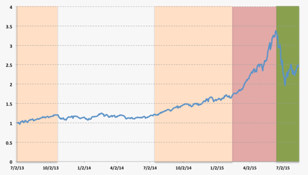

#1.市场状态#
金融市场通常会呈现2，3种市场状态（牛市， 熊市，震荡市）。每种市场状态分别代表的市场指数不同的特性：

- 牛市状态下，上涨的幅度和天数要超过下跌的幅度和天数。
- 熊市状态下则正好相反， 下跌的幅度和天数要高于上涨。
- 震动市状态，则是一个无方向性的状态， 上涨和下跌的天数和幅度不相上下。 


我们可以将中证500从2013年7月至2015年9月的净值曲线分为如上几个状态：



```{r message=FALSE}
source("gmmhmm.R")
data <- read.csv("data/NAV_5ETFs.csv")
zz500 <- as.xts(data[, 2], order.by=strptime(data[, 1], format="%Y-%m-%d", tz=""))
zz500 <- na.omit(cbind(zz500, Return.calculate(zz500)))
colnames(zz500) <- c('zz500', 'zz500.ret')
```

将中证500指数的日回报数据进行分析，我们可以看到它并不是一个理论的高斯正态分布，表现出负对称性和左端的厚尾。 


```{r echo=FALSE}
layout(rbind(c(1,2), c(3,4)))
chart.Histogram(zz500$zz500.ret, main = "Density", breaks=40, methods = c("add.density", "add.normal"))
chart.Histogram(zz500$zz500.ret, main = "Risk Measures", methods = c("add.risk"))
chart.QQPlot(zz500$zz500.ret)
table.Stats(zz500$zz500.ret)
```


因此，如果我们将市场指数（如沪深300）日回报（daily return），划分为如上所述的3个市场状态的3组数据， 则它们应该会整体呈现出如下特征：

- 牛市状态下， 平均回报率高（rate of return > 0), 波动性小， positive skewness
- 熊市状态下， 平均回报率低， 波动性大， negative skewness
- 震荡市状态下， 平均回报率趋近零， 波动性和skewness不定


#2. 通过机器学习的方法对指数数据分类#
所以如果我们可以通过机器学习以及相关的分类模型的方法， 对市场数据进行分析， 我们就可以更深入的了解当前的市场状态， 并作出相应的投资决策。 

这里我们使用两者机器学习领域常用的模型： 

*  1. 高斯混合模型（Gaussian Mixture Model － GMM）
*  2. 隐形马尔可夫模型（Hidden Markov Model - HMM)

## 2.1 隐形马尔可夫模型##

首先我们简要介绍一下什么是高斯混合模型GMM。

GMM模型可以如何帮我们实现对市场数据的分析呢？ 首先， 当我们认为市场存在n个状态（n＝2是牛熊市， n=3是牛熊市和震荡市， 当然n可以为任何>1的自然数），GMM分析所有的数据，并找到最佳的n个市场状态的中心点（中心点定义为该市场状态下的平均回报率r和波动性$\sigma$。 其次， GMM根据每个数据点距离n个分组中心点的距离（距离是由我们选定的每个分组的概率分布pdf方程决定的）， 告诉我们该数据点属于哪个分组的几率最高。 

也就是说，我们只要告诉GMM我们在寻找n=3个市场状态， 以及每个市场状态下数据的概率分布方程（Probability Distribution Function）是什么：通常选择正态分布（Normal Distribution）， GMM就会自动帮我们将市场数据分成几类。 

## 2.2 单一市场指数的HMM分析 ##
基于上述的分析， 我们用R中间的depmix软件包来分析中证500最近2008至2015年的数据。

### 测试1: 市场状态＝2 ###
我们选择2个市场状态，来看看HMM是否可以有效的将市场数据分开：
```{r message=FALSE}
data_case1 <- zz500$zz500.ret
gmm <- gmm_training(data_training = data_case1, nstate = 2)
hmm <- hmm_training(gmm, data_case1, data_case1)

ret_regime1 <- hmm$hmm_ret_regime[,1]
ret_regime1 <- ret_regime1[ret_regime1 != 0]
ret_regime2 <- hmm$hmm_ret_regime[,2]
ret_regime2 <- ret_regime2[ret_regime2 != 0]
```
```{r echo=FALSE}
### 第一个图
layout(rbind(c(1,2),c(3,4)))
plot.xts(zz500$zz500)
points(zz500$zz500[hmm$hmm_yhat==1], pch=20, col="black")
chart.Histogram(ret_regime1, main = "Density", breaks=40, methods = c("add.density", "add.normal"))
chart.Histogram(ret_regime1, main = "Risk Measures", methods = c("add.risk"))
chart.QQPlot(ret_regime1)

layout(rbind(c(1,2),c(3,4)))
plot.xts(zz500$zz500)
points(zz500$zz500[hmm$hmm_yhat==2], pch=20, col="red")
chart.Histogram(ret_regime2, main = "Density", breaks=40, methods = c("add.density", "add.normal"))
chart.Histogram(ret_regime2, main = "Risk Measures", methods = c("add.risk"))
chart.QQPlot(ret_regime2)


ret_regimes <- cbind.xts(hmm$hmm_ret_regime, zz500$zz500.ret)
ret_regimes[is.na(ret_regimes)] <- 0
colnames(ret_regimes) <- c("regime 1", "regime 2", "zz500")
charts.PerformanceSummary(ret_regimes)

rbind(table.AnnualizedReturns(ret_regimes), table.Distributions(ret_regimes), maxDrawdown(ret_regimes))
```


###测试2: 市场状态＝5 ###
如果我们将选择的市场状态从2个增加到5个， HMM模型分析的效果则大大的提升了。 

```{r message=FALSE}
data_case2 <- zz500$zz500.ret
gmm <- gmm_training(data_training = data_case2, nstate = 5)
hmm <- hmm_training(gmm, data_case2, data_case2)

ret_regimes <- cbind.xts(hmm$hmm_ret_regime, zz500$zz500.ret)
charts.PerformanceSummary(ret_regimes)
table.Stats(ret_regimes)
rbind(table.AnnualizedReturns(ret_regimes), table.Distributions(ret_regimes), maxDrawdown(ret_regimes))
```


###测试3.1: 引入其他相关数据  ###
目前我们使用的是指数的日回报率数据。 如果我们在分析数据里面引入日回报率的其他衍生数据， 用HMM模型分析的效果应该可以进一步提升：

我们将日回报率(r), 日回报率1天前和5天前的日回报率， 以及日回报率的RSI， MACD参数均引入模型：
```{r message=FALSE}
data_case3 <- cbind.xts(zz500$zz500.ret, lag(zz500$zz500.ret, 1), lag(zz500$zz500.ret, 5));
colnames(data_case3) <- c("ret", "ret1d", "ret5d")
data_case3 <- na.omit(data_case3)

gmm <- gmm_training(data_training = data_case3, nstate=5)
hmm <- hmm_training(gmm, data_case3, data_case3[,1])

ret_regimes <- cbind.xts(hmm$hmm_ret_regime, zz500$zz500.ret)
charts.PerformanceSummary(ret_regimes)
table.Stats(ret_regimes)
rbind(table.AnnualizedReturns(ret_regimes), table.Distributions(ret_regimes), maxDrawdown(ret_regimes))

```

###测试3.2: 现在我们在加上 日回报率的RSI， MACD参数均引入模型 ###
```{r message=FALSE}
ema_ret2d <- Return.calculate(TTR::EMA(zz500$zz500, n=2), method = "discrete")
ema_ret10d <- Return.calculate(TTR::EMA(zz500$zz500, n=10), method = "discrete")
data_case3 <- na.omit(cbind.xts(data_case3, ema_ret2d, ema_ret10d))
data_case3 <- na.omit(data_case3)

gmm <- gmm_training(data_training = data_case3, nstate=5)
hmm <- hmm_training(gmm, data_case3, data_case3[,1])

ret_regimes <- cbind.xts(hmm$hmm_ret_regime, zz500$zz500.ret)
charts.PerformanceSummary(ret_regimes)
rbind(table.AnnualizedReturns(ret_regimes), table.Distributions(ret_regimes), maxDrawdown(ret_regimes))

```

## 2.2多个市场的综合分析##
### 测试1 ###
现在把多个市场指数放在一起， HMM模型可以通过分析单个市场不同状态下的表现， 以及不同市场之间的相关性， 找到最佳的反应市场涨跌的状态：
首先把中证500和沪深300两个指数基金放在一起分析。两个指数分别代表了中国股市中小盘股票和大盘股票的表现。 
```{r} 
comb1 <- as.xts(data[, 2:3], order.by=strptime(data[, 1], format="%Y-%m-%d", tz=""))
comb1 <- na.omit(cbind.xts(comb1, Return.calculate(comb1)))
colnames(comb1) <- c('zz500', 'hs300', 'zz500.ret', 'hs300.ret')

data_22 <- comb1[, 3:4]
gmm <- gmm_training(data_training = data_22, nstate=10)
hmm <- hmm_training(gmm, data_22, zz500$zz500.ret)

ret_regimes <- cbind.xts(hmm$hmm_ret_regime, zz500$zz500.ret)
charts.PerformanceSummary(ret_regimes)
rbind(table.AnnualizedReturns(ret_regimes), table.Distributions(ret_regimes), maxDrawdown(ret_regimes))
```

加上过去数日的回报数据，分类效果应该会更好。
```{r}
data_22 <- na.omit(cbind.xts(data_22, lag(data_22, 1), lag(data_22, 5), lag(data_22, 10)))
gmm <- gmm_training(data_training = data_22, nstate=5)
hmm <- hmm_training(gmm, data_22, zz500$zz500.ret)

ret_regimes <- cbind.xts(hmm$hmm_ret_regime, zz500$zz500.ret)
charts.PerformanceSummary(ret_regimes)
rbind(table.AnnualizedReturns(ret_regimes), table.Distributions(ret_regimes), maxDrawdown(ret_regimes))
```

### 测试2 ###
除了中证500，沪深300外， 我们在加入了黄金ETF， 标普500和香港恒生ETF。

```{r} 
comb2 <- as.xts(data[, c(2, 3, 4)], order.by=strptime(data[, 1], format="%Y-%m-%d", tz=""))
comb2 <- na.omit(cbind.xts(comb2, Return.calculate(comb2)))
#colnames(comb2) <- c('zz500', 'hs300', 'gold', 'spx', 'hengsheng', 'zz500.ret', 'hs300.ret', 'gold.ret', 'spx.ret', 'hengsheng.ret')

data_22 <- comb2[, 4:6]
gmm <- gmm_training(data_training = data_22, nstate = 5)
hmm <- hmm_training(gmm, data_22, zz500$zz500.ret)

ret_regimes <- cbind.xts(hmm$hmm_ret_regime, zz500$zz500.ret)
charts.PerformanceSummary(ret_regimes)
rbind(table.AnnualizedReturns(ret_regimes), table.Distributions(ret_regimes), maxDrawdown(ret_regimes))
```

### 测试3 ###
我们可以尝试创造一个时间序列（中证500与沪深300的日均回报的差）

```{r} 
data_223 <- as.xts(data[, 2:6], order.by=strptime(data[, 1], format="%Y-%m-%d", tz=""))
ret_223 <- na.omit(Return.calculate(data_223, method="discrete"))

dataset_train_223 <- cbind.xts(ret_223$zz.500, ret_223$zz.500 - ret_223$hs.300,           lag(ret_223$zz.500, 1), lag(ret_223$zz.500, 5), lag(ret_223$zz.500, 10))

dataset_train_223 <- na.omit(dataset_train_223)

gmm <- gmm_training(data_training = dataset_train_223, nstate = 5)
hmm <- hmm_training(gmm, dataset_train_223, dataset_train_223, ret_223$zz.500)

ret_regimes <- cbind.xts(hmm$hmm_ret_regime, ret_223$zz.500)
charts.PerformanceSummary(ret_regimes)
rbind(table.AnnualizedReturns(ret_regimes), table.Distributions(ret_regimes), maxDrawdown(ret_regimes))
```

```{r}
nstate = 3
data_training <- dataset_train_223[1:1590]
gmm <- gmm_training(data_training = data_training, nstate)


regimes <- dataset_train_223[1400:1590, 1] * 0;

ret <- list();
for (j in 1:nstate) {
  ret[[j]] <- regimes;
}
ret <- do.call(cbind, ret)

for (i in 1430:1590) 
{
  data_testing <- dataset_train_223[(i-30):i]

  hmm <- hmm_training1(gmm, data_training, data_testing, data_testing[, 1])
  regime <- hmm$hmm_predict_regime;
  print(paste("i=", i, ":regime=", regime))
  
  regimes[index(regime)] <- coredata(regime)
  
  for (j in 1:nstate) {
    if (j == as.numeric(regime)) {
      ret[i+1-1430, j] <- dataset_train_223[index(ret[i+1-1430]), 1];
    }
    
  }
  
  ret_regimes <- na.omit(cbind.xts(ret, dataset_train_223[index(ret), 1]))
  charts.PerformanceSummary(ret_regimes)
  rbind(table.AnnualizedReturns(ret_regimes), table.Distributions(ret_regimes), maxDrawdown(ret_regimes))
tail(hmm$hmm_yhat)
}


  
  ret_regimes <- cbind.xts(hmm$hmm_ret_regime, data_testing[,1])
  charts.PerformanceSummary(ret_regimes)
  rbind(table.AnnualizedReturns(ret_regimes), table.Distributions(ret_regimes), maxDrawdown(ret_regimes))
tail(hmm$hmm_yhat)

`````````


